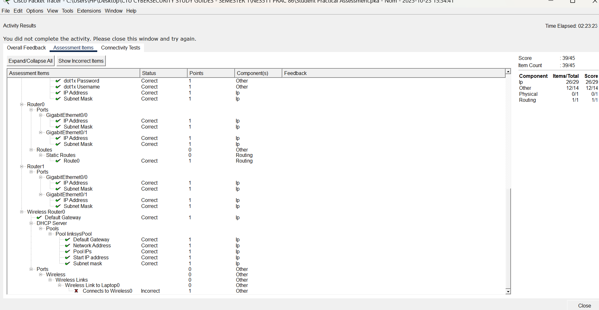
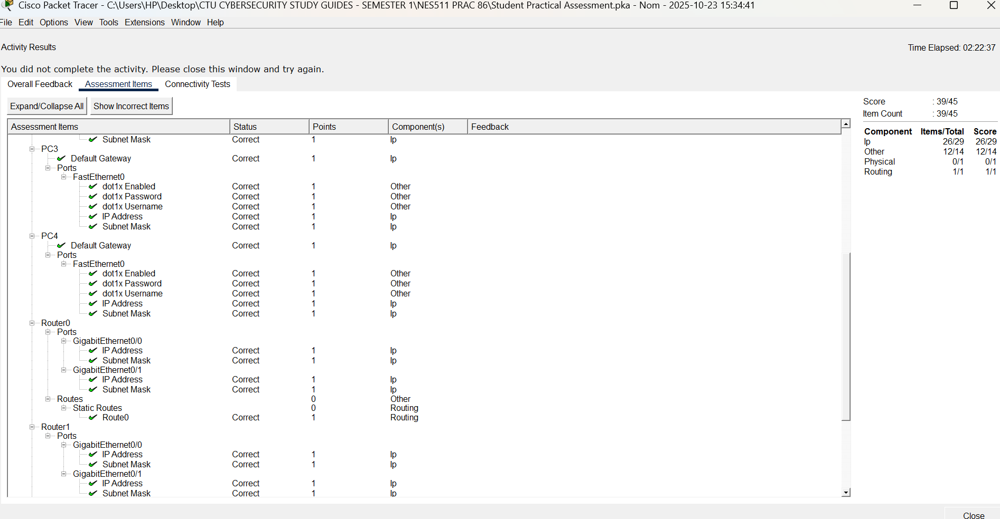
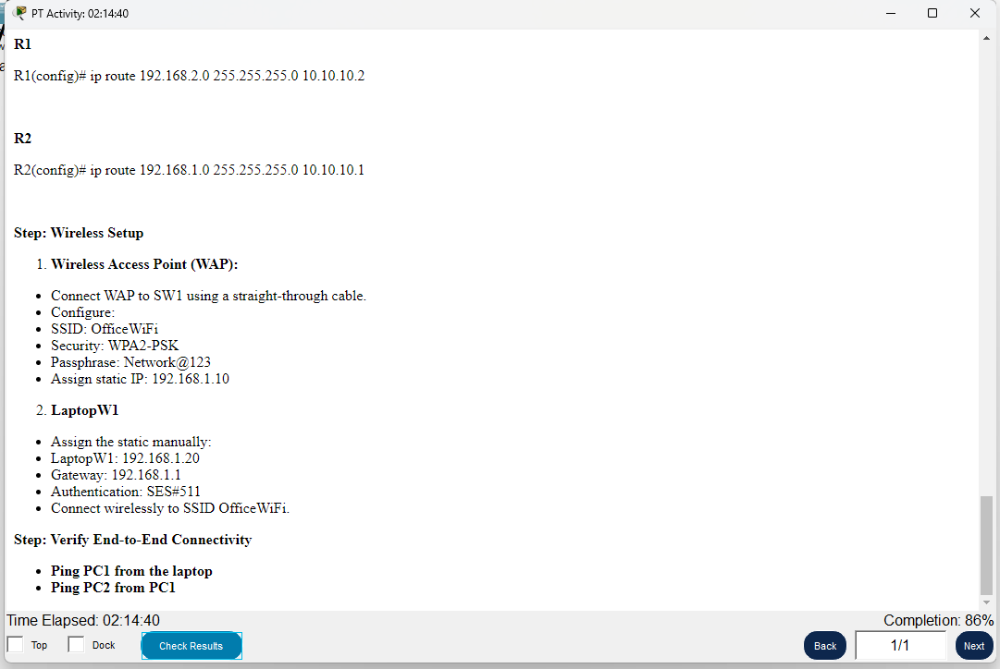
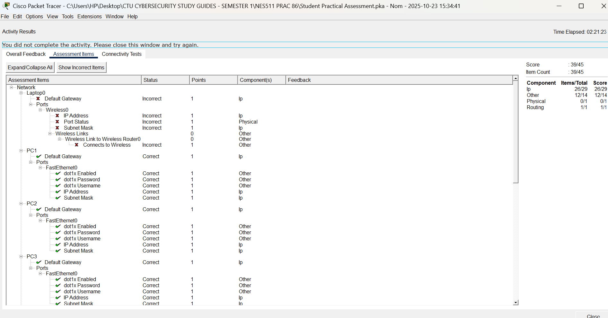

# Enterprise Network Design & Security Configuration


## Overview

Designed and configured a small enterprise network from scratch using Cisco Packet Tracer,
applying network security and defence principles. The project covers physical topology design,
router and interface configuration, static routing, wireless network setup with WPA2-PSK
security, 802.1x authentication on end hosts, and end-to-end connectivity verification.

---

## Network Design

### Network Topology


*Figure 1: Network topology — Router0 (left) connected to Switch0 with PC1, PC2 and Wireless Router0/LaptopW1; Router1 (right) connected to Switch1 with PC3 and PC4. Routers linked via Gig0/0 crossover.*

### Devices Used

| Device | Model | Role |
|--------|-------|------|
| Router0 | Cisco 2901 | Left-side core router |
| Router1 | Cisco 2901 | Right-side core router |
| Switch0 | Cisco 2960-24TT | Left-side access switch |
| Switch1 | Cisco 2960-24TT | Right-side access switch |
| PC1, PC2 | PC-PT | Left-side end hosts |
| PC3, PC4 | PC-PT | Right-side end hosts |
| Wireless Router0 | WRT300N | Wireless access point |
| LaptopW1 | Laptop-PT | Wireless client |

---

## Configuration Sections

#### Section A — Topology Design
Built the physical and logical network topology in Cisco Packet Tracer, placing and
cabling all devices according to the enterprise network requirements.

#### Section B — Router Interface Configuration
Configured IP addresses and subnet masks on both routers' Gigabit interfaces and brought
all interfaces to an active state with `no shutdown`. Router0 and Router1 connected via
crossover on Gig0/0.

#### Section C — Static Routing
Configured static routes on both routers to enable inter-network communication,
specifying next-hop addresses and verifying routing table entries.

```
R1(config)# ip route 192.168.2.0 255.255.255.0 10.10.10.2
R2(config)# ip route 192.168.1.0 255.255.255.0 10.10.10.1
```

#### Section D — Wireless Setup (WPA2-PSK)
Configured the WRT300N wireless access point with the following settings:

| Setting | Value |
|---------|-------|
| SSID | OfficeWiFi |
| Security | WPA2-PSK |
| Passphrase | Network@123 |
| WAP IP | 192.168.1.10 |
| LaptopW1 IP | 192.168.1.20 |
| LaptopW1 Gateway | 192.168.1.1 |
| Authentication | SES#511 |


*Figure 2: PT Activity instructions — static route commands for R1 and R2, wireless setup requirements including SSID OfficeWiFi, WPA2-PSK, and LaptopW1 static IP assignment*

#### Section E — 802.1x Authentication
Configured dot1x (port-based authentication) on all end host FastEthernet ports — PC1
through PC4 — with username/password credentials verified across the assessment.

#### Section F — Connectivity Verification
Used `ping` to test end-to-end connectivity across all network segments, confirming that
routing and addressing were correctly configured.

---

## Security Concepts Applied

| Concept | Implementation |
|---------|---------------|
| Wireless encryption | WPA2-PSK — protecting over-the-air traffic |
| Network segmentation | Separate subnets for different network areas |
| Static routing | Controlled, predictable inter-segment routing |
| Device hardening | Password-protected router access |
| Port-based authentication | 802.1x dot1x on all end host ports |

---

## Assessment Results

The assessment was scored using Packet Tracer's built-in activity checker across 45 items.
**Final score: 39/45.**

### Component Breakdown

| Component | Score |
|-----------|-------|
| IP addressing | 26/29 |
| Other (auth, DHCP, routing config) | 12/14 |
| Physical cabling | 0/1 |
| Routing | 1/1 |


*Figure 3: Assessment results (page 1) — PC1, PC2, PC3 dot1x enabled/password/username and IP address all Correct; Laptop0 default gateway and wireless connection flagged Incorrect*


*Figure 4: Assessment results (page 2) — PC4 configuration correct; Router0 Gig0/0 and Gig0/1 IP addresses correct; static Route0 correct on both routers*


*Figure 5: Assessment results (page 3) — Wireless Router0 default gateway, DHCP pool (network address, pool IPs, start IP, subnet mask) all Correct; wireless laptop connection flagged Incorrect*

---

## Key Skills Demonstrated

- Enterprise network topology planning and physical cabling in Cisco Packet Tracer
- Router interface configuration across multiple network segments
- Static route implementation and inter-network routing
- WPA2-PSK wireless network security configuration
- 802.1x port-based authentication on end host ports
- DHCP pool configuration on wireless router
- End-to-end connectivity testing and troubleshooting
- Applying CIA triad principles to network design

---

## Files in This Repository

```
├── assets/
│   ├── topology-overview.png
│   ├── static-routes-wireless-config.png
│   ├── assessment-results-page1.png
│   ├── assessment-results-page2.png
│   └── assessment-results-page3.png
└── README.md
```

> Note: The `.pka` simulation file is not included — assessment submissions remain with CTU.
> All configuration details and results are documented above with screenshots.

---

## Author

**Sindiswa Msubo**
Cybersecurity Student | Aspiring SOC Analyst
[LinkedIn](https://www.linkedin.com/in/sindiswa-msubo-1b908716a/) | [GitHub](https://github.com/Sindi298)
